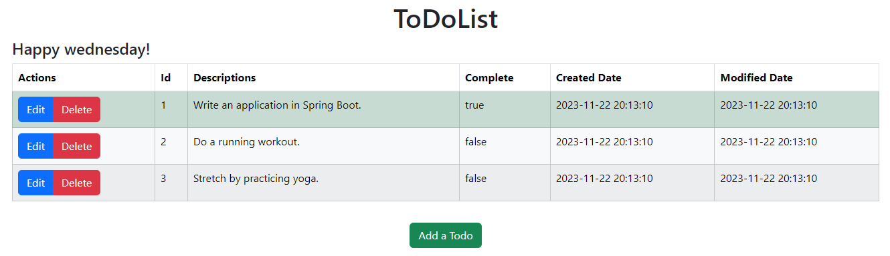

> # Spring Boot Todo Application
 

> This application allows to:
>
> <ul>
>   <li>add new tasks</li>
>   <li>update existing tasks</li>
>   <li>delete existing tasks</li>
> <ul>

> This application uses:
>
> <ul>
>   <li>Spring Data JPA</li>
>   <li>H2 Database</li>
>   <li>Thymeleaf</li>
> </ul> 

> *Development Instructions:*
> <ol>
>   <li>git clone https://github.com/stepniewskirafal/ToDoListApp.git</li>
>   <li>mvnw spring-boot:run</li>
> <ol>